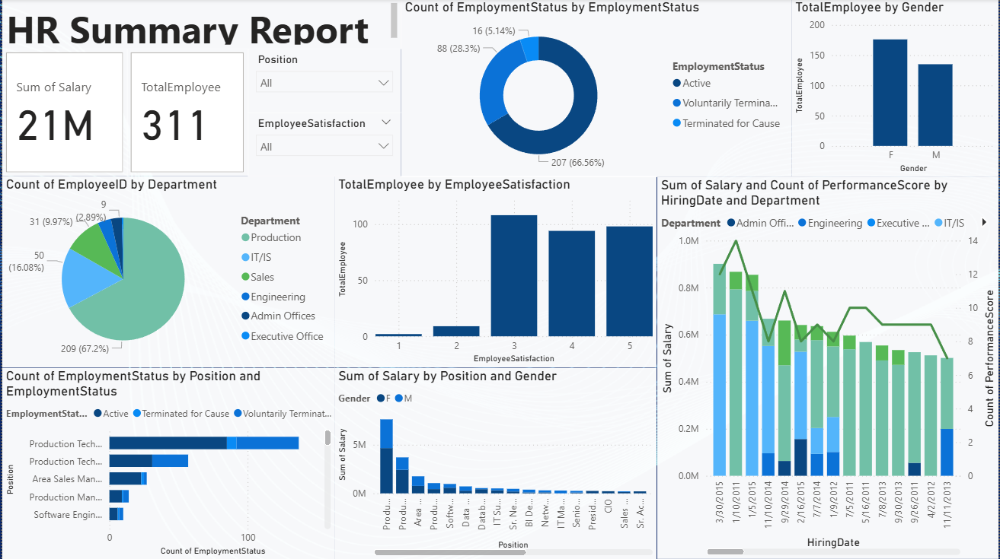

Here’s a clean, professional **README.md** you can use for your HR Summary Dashboard project 👇

---

# 📊 HR Summary Dashboard

## 📌 Overview

The **HR Summary Dashboard** provides a comprehensive view of employee data, enabling data-driven decision-making in workforce management. It consolidates key HR metrics such as employee count, salary distribution, satisfaction levels, and attrition trends into an interactive and visually intuitive report.

This dashboard is designed for HR managers, business analysts, and leadership teams to quickly assess organizational health and identify actionable insights.

---

## 🎯 Objectives

* Monitor overall workforce metrics
* Analyze employee distribution across departments and roles
* Track employee satisfaction and performance
* Identify attrition patterns and employment status trends
* Support strategic HR decision-making

---

## 📈 Key Metrics

* **Total Employees:** 311
* **Total Salary Expense:** 21M
* **Employee Satisfaction Levels**
* **Performance Score Distribution**

---

## 📊 Dashboard Features

### 1. Workforce Overview

* Displays total employee count and total salary
* Provides filters for:

  * **Position**
  * **Employee Satisfaction**

---

### 2. Employment Status Analysis

* Visual breakdown of:

  * Active employees
  * Voluntary terminations
  * Terminated for cause
* Helps identify attrition patterns

---

### 3. Gender Distribution

* Comparison of employee count by gender
* Supports diversity and inclusion analysis

---

### 4. Department Distribution

* Employee count across departments:

  * Production
  * IT/IS
  * Sales
  * Engineering
  * Admin Offices
  * Executive Office

---

### 5. Employee Satisfaction Analysis

* Distribution of satisfaction ratings (1–5)
* Helps understand employee engagement levels

---

### 6. Salary Insights

* Salary distribution by:

  * Position
  * Gender
* Identifies pay gaps and compensation trends

---

### 7. Hiring Trends & Performance

* Salary trends over time by hiring date
* Performance score comparison across departments
* Useful for workforce planning and forecasting

---

### 8. Position vs Employment Status

* Breakdown of employment status by job roles
* Identifies roles with higher attrition

---

## 🛠️ Tech Stack

* **Tool:** Power BI
* **Data Processing:** Power Query
* **Visualization:** Interactive charts, filters, slicers
* **Data Modeling:** Relationships & calculated measures (DAX)

---

## 🔍 Insights You Can Derive

* Departments with highest employee concentration
* Roles with high turnover
* Correlation between satisfaction and retention
* Salary distribution across roles and genders
* Hiring patterns over time

---

## 🚀 How to Use

1. Open the Power BI dashboard file
2. Use filters (Position, Satisfaction) to customize analysis
3. Hover over visuals for detailed insights
4. Drill down into specific departments or roles

---

## 📌 Use Cases

* HR Analytics
* Workforce Planning
* Employee Retention Strategy
* Compensation Analysis
* Diversity & Inclusion Tracking

---

## 📷 Dashboard Preview

---

## 👩‍💻 Author

**Monasri**
Final Year – AI & Data Science
Passionate about Data Analytics, AI, and Business Intelligence
