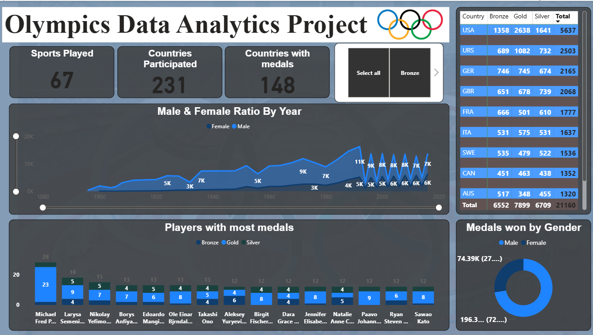

# 🏅 Olympics Data Analytics Dashboard


---

## 📌 Overview

An interactive **Olympics Data Analytics Dashboard** built using **Power BI** to analyze global participation, medal distribution, and athlete performance trends.

This project focuses on transforming raw Olympic data into **clear, actionable insights** using modern data visualization techniques.

---

## 🎯 Objectives

✔ Analyze global Olympic participation trends
✔ Evaluate country-wise medal performance
✔ Understand gender distribution over time
✔ Identify top-performing athletes
✔ Build an interactive BI dashboard

---

## 🖼️ Dashboard Preview



---

## 📊 Key Features

### 🔹 KPI Cards

* 🏟️ Sports Played: **67**
* 🌍 Countries Participated: **231**
* 🥇 Countries with Medals: **148**

---

### 🔹 Gender Participation Trend

📈 Line chart showing **Male vs Female participation over years**

* Identifies growth trends
* Highlights gender gap reduction

---

### 🔹 Top Athletes Analysis

🏅 Bar chart of **players with most medals**

* Gold, Silver, Bronze breakdown
* Highlights consistent performers

---

### 🔹 Country-wise Medal Distribution

🌎 Tabular view of medal counts

* Compare top-performing countries
* Analyze global dominance

---

### 🔹 Gender-based Medal Distribution

🍩 Donut chart showing:

* Male vs Female medal share

---

### 🔹 Interactive Filters

🎛️ Dynamic slicers for:

* Medal types
* Data exploration

---

## 🛠️ Tech Stack

| Category           | Tools            |
| ------------------ | ---------------- |
| 📊 Visualization   | Power BI         |
| 🔄 Data Processing | Power Query      |
| 🧠 Data Modeling   | DAX              |
| 📁 Dataset         | Olympics Dataset |

---

## 📈 Key Insights

✔ Female participation has **increased significantly over time**
✔ A few countries dominate **medal rankings consistently**
✔ Top athletes contribute disproportionately to total medals
✔ Noticeable **gender imbalance in medal distribution**

---

## 🎨 Design Highlights

✨ Sports-themed background
✨ Clean card-based layout
✨ Consistent color scheme:

* 🥇 Gold
* 🥈 Silver
* 🥉 Bronze

✨ Focus on **readability + storytelling**

---

## 🚀 Use Cases

📌 Data Analytics Portfolio
📌 Business Intelligence Demonstration
📌 Sports Data Analysis
📌 Academic Projects

---

## 📂 How to Use

```bash
1. Download the .pbix file
2. Open in Power BI Desktop
3. Use filters and slicers to explore
4. Hover on visuals for insights
```

---

## 🔮 Future Enhancements

🚀 Medal prediction using ML
🚀 Real-time Olympic data integration
🚀 Advanced drill-down analytics
🚀 Custom dashboard themes

---

## 👩‍💻 Author

**Monasri** - AI & Data Science

---


---

## 🧠 What This Project Demonstrates

✔ Data Visualization Skills
✔ Analytical Thinking
✔ Business Insight Generation
✔ Real-world BI Application
